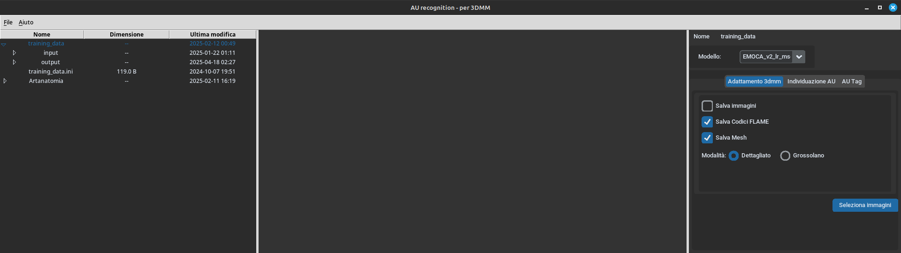
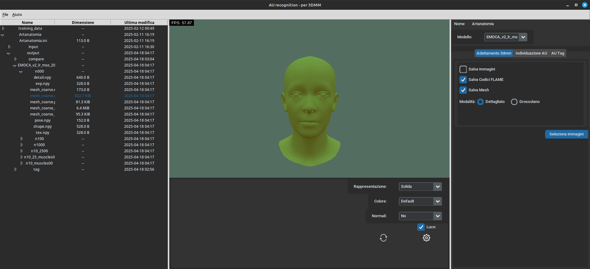

<h1 align="center">AU Recognizer: GUI for 3DMM mesh fitting and Mesh AU Tagging</h1>

<p align="center">home screen of the program.<p>


AU Recognizer currently uses EMOCA v2 as a 3dmm Model to take in-the-wild images as input and reconstructs a 3D face mesh, then with a neutral face from the same subject gives the option to see the difference between the two mesh by taking advantage of the FLAME topology, and if the Action Unit coding displayed by the faces are provided it can for each point of the face tag it with the action units that can move it. EMOCA official project page is [here](https://emoca.is.tue.mpg.de/index.html).
 
## Installation 

### Dependencies

1) Install [conda](https://docs.conda.io/en/latest/miniconda.html)


2) Clone this repo
### Short version
1) Run the installation script:
```bash
bash install_au_env_311.sh
```

2) Pull the models of Emoca, needed to run the fitting, you will need to accept the license terms at [FLAME](https://flame.is.tue.mpg.de) and [EMOCA]( https://emoca.is.tue.mpg.de):

```bash
bash download_assets.sh
```

If this ran without any errors, you now have a functioning conda environment with all the necessary packages to [run the code](#usage). If you had issues with the installation script, go through the [long version](#long-version) of the installation and see what went wrong. Certain packages (especially for CUDA, PyTorch and PyTorch3D) may cause compatibility issues.

### Long version

1) Set up a conda environment with the provided conda file.

You can use [mamba](https://github.com/mamba-org/mamba) to create a conda environment (strongly recommended):

```bash
mamba env create python=3.11 --file conda-environment_py311_cu121.yml
```

but you can also use plain conda if you want (but it will be slower): 
```bash
conda env create python=3.11 --file conda-environment_py311_cu121.yml
```

In case the specified pytorch version somehow did not install, try again manually: 
```bash
mamba install pytorch==2.4.0 torchvision torchaudio cudatoolkit=12.1 -c pytorch
```

2) Activate the environment: 
```bash 
conda activate au_env
```

3) sometimes cython may glitch, so install it separately: 
```bash 
pip install Cython==0.29
```

4) Verify that previous step correctly installed Pytorch3D

For some people the compilation fails during requirements install and works after. Try running the following separately:

```bash
pip install git+https://github.com/facebookresearch/pytorch3d.git@V0.7.8
```

Pytorch3D installation (which is part of the installation script and needed by EMOCA) can unfortunately be tricky and machine specific. for pytorch3D, pytorch needs to be compiled in a CUDA version supported by your PC, you can check it with `nvcc --version`. If it fails to compile, you can try to find another way to install Pytorch3D.

5) Pull the models of Emoca, needed to run the fitting, you will need to accept the license terms at [FLAME](https://flame.is.tue.mpg.de) and [EMOCA]( https://emoca.is.tue.mpg.de):

```bash
bash download_assets.sh
```

## Usage

0) Activate the environment: 
```bash
mamba activate au_env
```

1) For running Au_recognizer, run `main.py` 
```bash
python main.py
```

now you will see the main GUI of the application

<p align="center"> 

</p>
<p align="center">home screen of the program.<p>

From here you will need to open or create a new project and select it, once it is selected add images to it with `right click`->`add images` or copy them inside the `input` folder. to fully use the app the images should follow this naming convention: `nameWithoutNumbers_AU_numbers_list_separated_without_letters`. Right now, it does not support encoding action unit strength in the file name.
Example: `subject1_2_4` (indicates that AUs 1, 2, and 4 are activated)

**I uploaded the sample data  i used taken from Artanatomia under  `var\data\ `**

<table>
  <tr>
    <td align="center">
      <br/>
      <em>New or open</em>
    </td>
    <td align="center">
      <br/>
      <em>Select a project, and add images</em>
    </td>
  </tr>
</table>

Once you have added images to the input folder, you can select a 3DMM model to fit them and generate the corresponding face meshes. The fitting process may take some time, and a popup window will display the progress.

<table>
  <tr>
    <td align="center">
      <br/>
      <em>On the left you have a combobox to choose the model and the fitting settings</em>
    </td>
    <td align="center">
      <br/>
      <em>Pop up window to select the images to fit</em>
    </td>
  </tr>
</table>

Once fitted you can see the file in the `output` folder, by selecting an `.obj` file an openGL renderer will show in the middle, you can rotate the mesh and select the viewer settings.

<table>
  <tr>
    <td align="center">
      <br/>
      <em>OpenGL viewer of the mesh, you can choose the viewer settings</em>
    </td>
    <td align="center">
      <br/>
      <em>Color settings of the OpenGL viewer</em>
    </td>
  </tr>
</table>

Now you can do two additional steps, one is mesh difference, that lets you choose a neutral mesh and a list of meshes to compare to it to, another is tagging.

<table>
  <tr>
    <td align="center">
      <br/>
      <em>On the right you have two tables, from the first select the neutral mesh, from the second one choose one or more meshes to compare</em>
    </td>
    <td align="center">
      <br/>
      <em>Once the comparison is done you can click the tag button for the next step, this will only work if your files follow the naming convention</em>
    </td>
    <td align="center">
      <br/>
      <em>Action unit tagging window, choose the desired diff files, and threshold</em>
    </td>
  </tr>
</table>

The first step will generate meshes with difference heat color map and diff file, second step will use diff files to generate a json where for each point of the FLAME topology tags it with the AU numbers relative to the diff mesh. you can visualize them both like this:

<table>
  <tr>
    <td align="center">
      <br/>
      <em>By selecting a mesh created by the compare step you will see the two relative images and the mesh with the heatmap</em>
    </td>
    <td align="center">
      <br/>
      <em>By selecting the json file you will see a blank mesh and will have a combobox to see the overlays generated by the various action units</em>
    </td>
  </tr>
</table>

## Structure 
This repo has 3 subpackages inside the main package. `core` and `ext_3dmm` and `external`

### core
`core` is a package with the app logic. It includes the following: 

- `controllers` contains all the controllers of the app, with most of the app logic.
- `model` contains code that bridge the gap between the app and the ext_3dmm models.
- `user_interface` contains all the views, dialog and widgets needed for the user interface of the app.
- `util` - various tools

### ext_3dmm
`ext_3dmm` is a package to keep models, it has emoca projects that is a library full of research code. It includes the following: 

- `models` is a module with deep learning modules (pytorch based) 
- `layers` contains individual deep learning layers 
- `datasets` contains base classes and their implementations for various datasets.
- `utils` - various tools

### external
`external` has external dependencies of 3dmm, like emonet

## License
This code and model are **available for non-commercial scientific research purposes** as defined in the [LICENSE](https://emoca.is.tue.mpg.de/license.html) file. By downloading and using the code and model you agree to the terms of this license. 

## Acknowledgements 
There are many people who deserve to get credited. These include but are not limited to: 
Yao Feng and Haiwen Feng and their original implementation of [DECA](https://github.com/YadiraF/DECA).
Antoine Toisoul and colleagues for [EmoNet](https://github.com/face-analysis/emonet).
